# 校园轻集市 — 项目规划

## 一、页面清单

| # | 页面 | 路由 | 说明 |
|---|------|------|------|
| 1 | 身份创建页 | `/create-profile` | 首次进入填写昵称/学院/校区/角色 |
| 2 | 今日集市首页 | `/` | 概览、快捷入口、最新/热门信息、统计卡片 |
| 3 | 集市信息列表页 | `/items` | 搜索、类型/校区/状态筛选、排序、信息卡片 |
| 4 | 信息详情页 | `/items/:id` | 完整内容 + 类型专属字段 + 收藏/砍价/联系 |
| 5 | 信息发布页 | `/publish` | 统一入口，按类型动态切换字段 |
| 6 | 消息中心页 | `/messages` | 会话列表 + 聊天记录 + 发送消息 |
| 7 | 个人中心页 | `/profile` | 用户资料 + 我的发布 + 我的收藏 + 状态管理 |
| 8 | 趋势看板页 | `/trends` | 类型占比、校区分布、状态统计、热门排行 |
| 9 | 安全提醒页 | `/safety` | 线下交易安全提示卡片 |

---

## 二、功能模块

```mermaid
graph TD
    A[校园轻集市] --> B[身份创建]
    A --> C[今日集市首页]
    A --> D[集市信息浏览]
    A --> E[信息详情]
    A --> F[信息发布]
    A --> G[收藏管理]
    A --> H[模拟砍价]
    A --> I[消息中心]
    A --> J[个人中心]
    A --> K[趋势看板]
    A --> L[安全提醒]

    D --> D1[关键词搜索]
    D --> D2[类型/校区/状态筛选]
    D --> D3[排序]

    E --> E1[类型专属字段展示]
    E --> E2[收藏/取消收藏]
    E --> E3[砍价入口-仅二手]
    E --> E4[联系发布者]

    F --> F1[类型选择]
    F --> F2[通用字段]
    F --> F3[类型专属字段]
    F --> F4[表单校验]

    G --> G1[收藏/取消收藏]
    G --> G2[状态同步-列表/详情/个人中心]

    H --> H1[输入出价]
    H --> H2[生成模拟回复]
    H --> H3[写入消息记录]

    I --> I1[会话列表]
    I --> I2[聊天记录]
    I --> I3[发送消息]
    I --> I4[模拟回复生成]

    J --> J1[用户资料展示]
    J --> J2[我的发布-含状态更新]
    J --> J3[我的收藏]

    K --> K1[类型占比图]
    K --> K2[校区分布图]
    K --> K3[状态统计图]
    K --> K4[热门信息排行]
```



---

## 三、数据模型

```
users         → id, nickname, college, campus, role, creditScore, avatar
items         → id, type, title, description, campus, location, tags, images,
                publisherId, status, viewCount, favoriteCount, createdAt, updatedAt
                └─ type专属: price/condition (二手) | lostOrFound/eventTime/itemFeature (失物)
                            targetCount/currentCount/deadline (拼单) | reward/taskPlace/expectedTime (跑腿)
favorites     → id, userId, itemId, createdAt
conversations → id, itemId, buyerId, publisherId, lastMessage, unreadCount, updatedAt
messages      → id, conversationId, senderId, receiverId, content, messageType, createdAt, read
notices       → id, title, content, type, createdAt
```

---

## 四、开发顺序

```
第1天 ─── 基础设施 + 身份创建 + 首页
  ├── 初始化 JSON Server + db.json
  ├── 身份创建页（表单 → 保存用户 → 跳转首页）
  ├── 今日集市首页（概览 + 入口卡片）
  └── Pinia userStore + router 基础配置

第2天 ─── 信息发布 + 信息列表
  ├── 信息发布页（动态表单 + 校验）
  ├── 集市信息列表页（搜索 + 筛选 + 排序）
  ├── itemsStore + API 层
  └── JSON Server items 接口对接

第3天 ─── 信息详情 + 收藏功能
  ├── 信息详情页（类型专属字段展示）
  ├── 收藏/取消收藏 + 状态同步
  └── favoritesStore + 接口对接

第4天 ─── 消息中心 + 模拟砍价
  ├── 消息中心（会话列表 + 聊天记录 + 发送消息）
  ├── 模拟回复生成逻辑
  ├── 模拟砍价（输入出价 → 生成砍价/回复消息）
  └── conversationsStore + messagesStore

第5天 ─── 个人中心 + 状态管理
  ├── 个人中心页（资料 + 我的发布 + 我的收藏）
  ├── 发布状态修改 → 列表/详情同步
  └── 数据一致性校验

第6天 ─── 趋势看板 + 安全提醒
  ├── 集成 ECharts
  ├── 趋势看板页（4 类图表）
  ├── 安全提醒页/组件
  └── 全功能联调

第7天 ─── 优化 + 演示准备
  ├── 空状态 / 加载 / 错误处理
  ├── 响应式布局微调
  ├── 演示流程走通
  └── 填写 Evidence + Git 提交
```

---

## 五、开发重点

1. **JSON Server Mock API 搭建** — 所有业务数据依赖于此，必须先搭好数据结构再开发页面。

2. **四类信息的统一与差异化** — `items` 表通用字段 + 类型专属字段的设计，表单/详情/列表都要按 type 做条件渲染。

3. **收藏状态一致性同步** — 列表页、详情页、个人中心三处收藏状态必须一致，这是 Pinia 数据流设计的核心难点。

4. **模拟回复生成** — 消息中心的模拟回复和砍价回复需要一套可扩展的规则引擎，不能硬编码。

5. **ECharts 数据统计** — 趋势看板需要前端对 JSON Server 数据做聚合计算，涉及数组分组、计数、排序等数据处理。

6. **动态表单** — 发布页根据类型切换字段集，表单校验规则也要跟着变，适合封装成可配置的表单组件。

7. **无真实登录下的身份模拟** — 整个系统基于本地用户档案运行，要确保创建身份后才可操作，路由守卫做好拦截。
